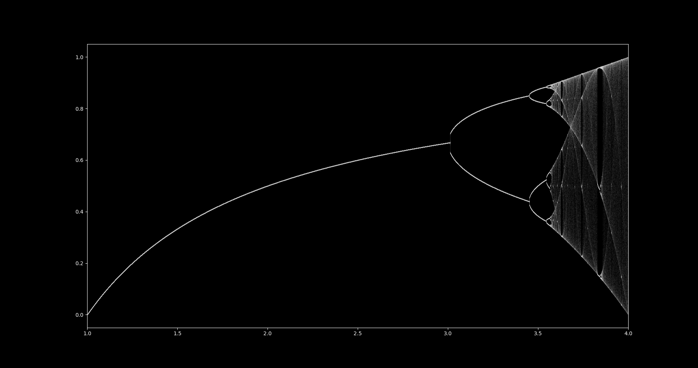

# Logistic Map Fractal

"The logistic map is a polynomial mapping (equivalently, recurrence relation) of degree 2, often referred to as an archetypal example of how complex, chaotic behaviour can arise from very simple nonlinear dynamical equations. The map was popularized in a 1976 paper by the biologist Robert May,[1] in part as a discrete-time demographic model analogous to the logistic equation written down by Pierre François Verhulst.[2]" - [Logistic Map Wiki](https://en.wikipedia.org/wiki/Logistic_map)

# Construction
* Pytorch Tensors are used to form a coordinate map of the fractal
* There are 1,000,000 iterations to form the fractal
* Matplotlib used to plot coordinate map of fractal
* GPU accelerated computing
## Iteration Process
1. Pytorch zero tensors specified
2. Initial conditions of r = 1, x = 0.5
3. x[i + 1] = r * x[i] * (1 - x[i])
4. Repeat

# Result

  

